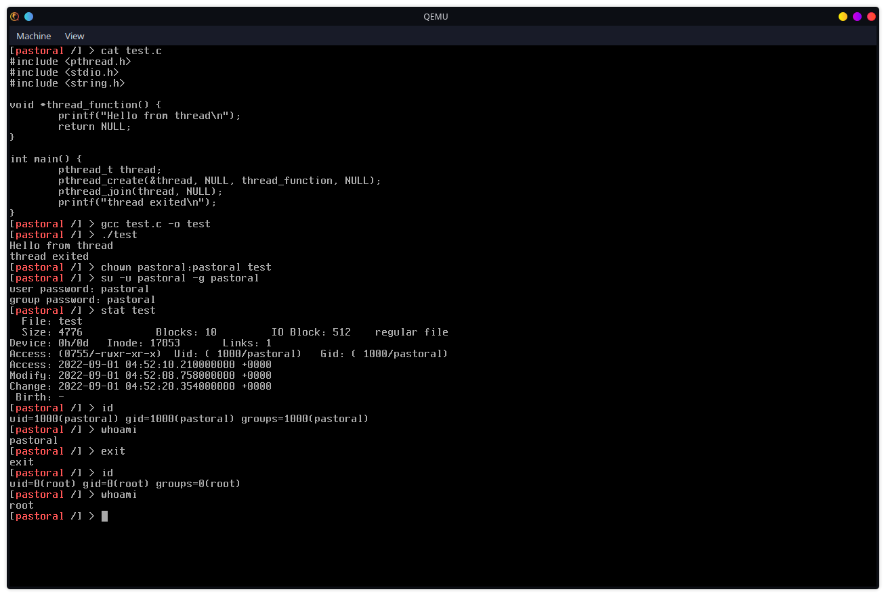

# pastoral

An x86_64 operating system, striving to be to an *actual* UNIX clone

Running on real hardware is also generally no issue either [real hardware](misc/on_real_hardware.md)

# Features

Bootloader:
- Limine, using the Limine boot protocol

Kernel:
- x86 system tables and architecture subsystems (GDT/IDT/TSS/EHFI/XAPIC/X2APIC/LA57)
- Module bitmap PMM
- VMM equipped with CoW and demand paging
- Slab allocator
- Unix-like VFS, FDs, Permissions (uids/gids)
- Preemptive multicore (SMP) scheduler
- Sessions and process groups
- Timers (HPET/PIT/APIC)
- Posix standard signals
- Unix domain sockets
- POSIX threads

Userland:
- Pastorals userspace is powered by  which facilitates many ports, including:
  - bash
  - binutils
  - coreutils
  - gcc

# Dependencies

The only dependices that you may or may not have are xbstrap and qemu, so make sure those are there

# Installation

- Build toolchain
  - `cd user`
  - `make build_toolchain`
  - `cd ..`
- Run
  - `make run`

# Contributing
Contributors are very welcome, just make sure the code style matches the rest of the code
